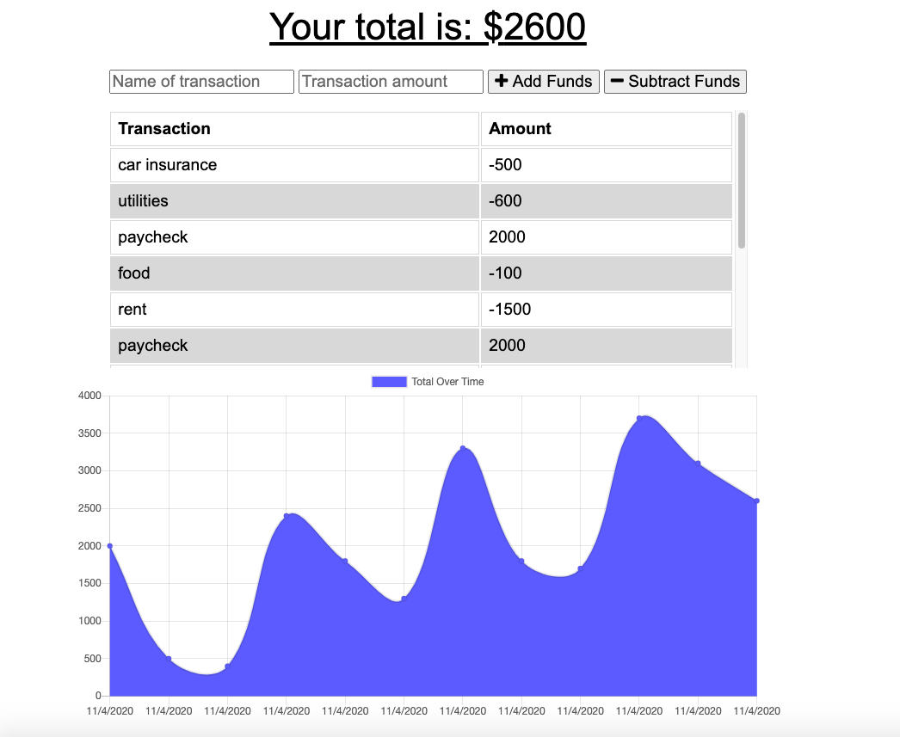
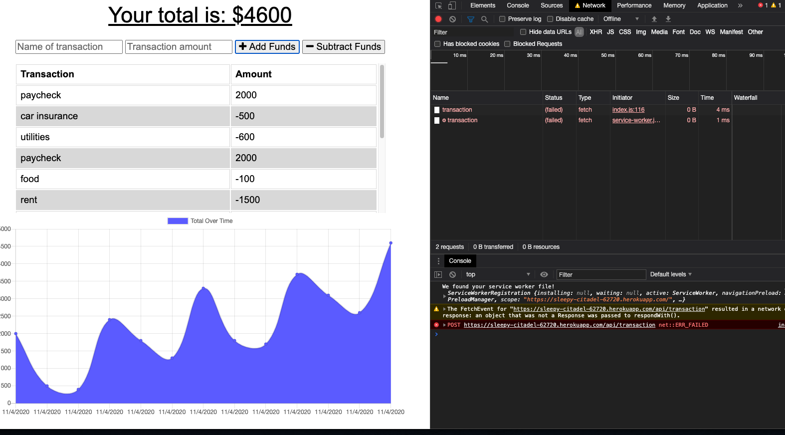
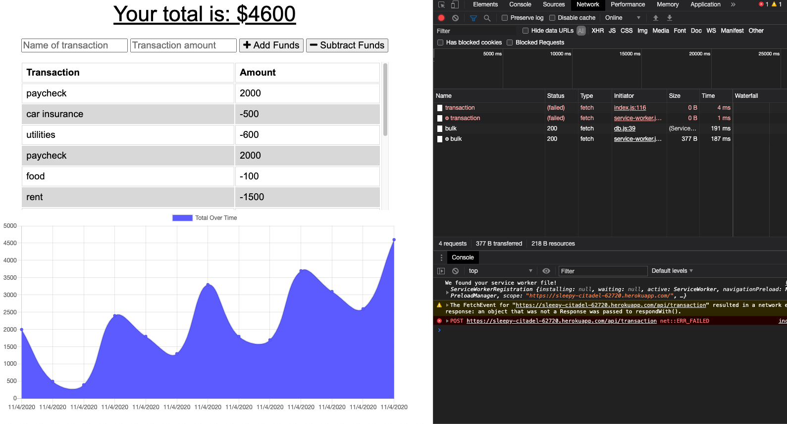
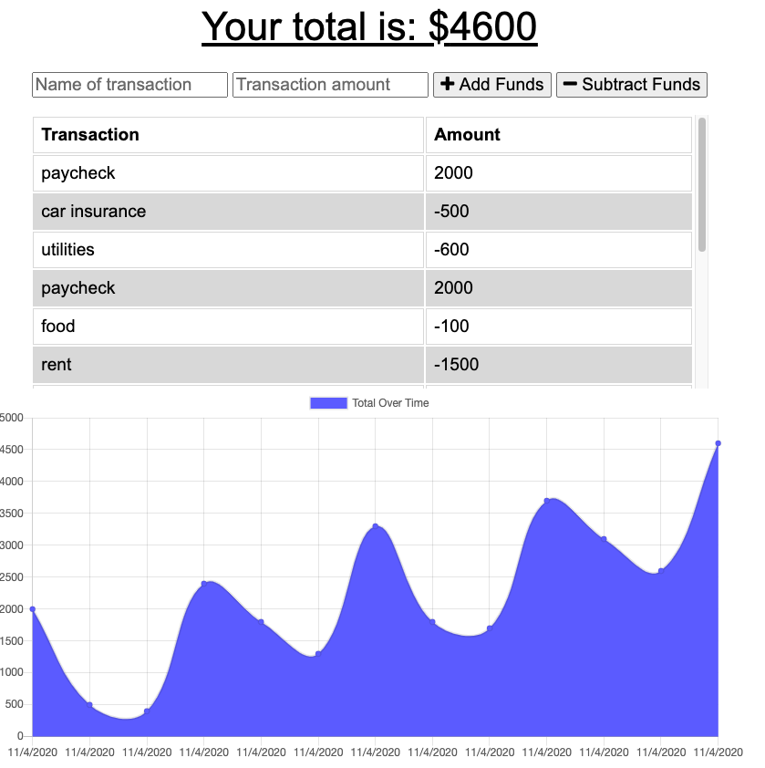

# Budget Tracker

  

  ## Description

  The budget tracker is an application that allows you to add expenses and deposits to the application without online access and when connectivity resumes, all transactions made during offline should be added to the database.

  ## Table of Contents

  -[Installation](#installation)

  -[Usage](#Usage)

  -[License](#license)

  -[Contributing](#contributing)

  -[Tests](#tests)

  -[Questions](#questions)
  
  -[Demonstration](#demonstration)

  ## Installation

  npm i compression, npm i express, npm i lite-server, npm i mongoose, npm i morgan

  ## Usage

  Just be careful and create your own branch when working with repo.

  ## License

  This project is licensed under [MIT](https://opensource.org/licenses/MIT) license.

  ## Contributing

  Just be careful.

  ## Tests

  TBD

  ## Questions

  If you have any questions about the repo, open an issue or contact me directly at egomezfax19@gmail.com. You can find more of my work at [www.github.com/egome019](https://github.com/egome019)

  ## Demonstration
  
  [Click here](https://sleepy-citadel-62720.herokuapp.com/) to be directed to the application.
  
  
  Image below shows app working offline.
  
  
  Image below shows app updating database when back online.
  
  
  Image below shows the data persisting after database is updated.
  
